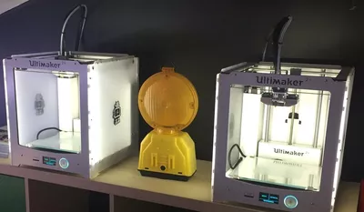

# Intercettazioni ambientali


Il Luiss LOFT ora è salvo. Giusto in tempo per ospitare il vertice col Prof. Italiano e la Prof.ssa Finocchi durante il quale si deciderà il vincitore della gara Crack The Puzzle, tenutasi Sabato 26 Marzo, che assegnerà al primo classificato una borsa di studio per il Corso di Laurea Triennale in Management and Computer Science presso la Luiss Guido Carli. È una riunione molto importante, per questo Marco sta controllando che tutto il Luiss LOFT sia in ordine. Dopo essersi assicurato che nessun oggetto fosse stato spostato da qualche studente maldestro, però, Marco sente un rumore in lontananza:  
"Non va bene, nessuno può fare rumore nel LOFT!"  

  
*Uno dei tanti alberi adiacenti al Luiss LOFT*

Da un'analisi più attenta, Marco scopre la vera provenienza del rumore: qualcuno è salito su un albero adiacente al LOFT e ha puntato un microfono direzionale verso il centro della sala per interferire con la scelta del vincitore di Crack The Puzzle. Marco, ovviamente, aveva già pensato a questa possibilità e ha predisposto in anticipo una serie di pannelli fonoassorbenti in punti strategici. Se il raggio di azione del microfono direzionale interseca un pannello fonoassorbente, l'intera intercettazione sarà disturbata.   
Ogni pannello fonoassorbente ha forma rettangolare ed è disposto in verticale, perfettamente perpendicolare al pavimento. Poichè il Luiss LOFT si estende su un solo livello, ciascun pannello fonoassorbente può essere approssimato con un segmento. Per lo stesso motivo, il raggio di azione del microfono direzionale è composto da una semiretta con origine nota (l'albero adiacente al LOFT).  
Il tuo compito è calcolare se il raggio di azione del microfono direzionale interseca uno dei pannelli fonoassorbenti; se il raggio di azione interseca più pannelli, dovrai calcolare il primo punto di intersezione (quello più vicino all'albero adiacente al LOFT, dove è posizionato il microfono).  

  
*Le stampanti 3D del Luiss LOFT*

## Assunzioni

- $N$, $t_i$ interi
- $1 \leq N \leq 50000$
- Tutte le coordinate sono in valore assoluto $\leq 2^{51}$
- $T \leq 30$.

## Casi di test

- Nel primo caso di test il microfono è posizionato sull'asse x. I pannelli sono posizionati entro un raggio di $100$m dall'origine (immagina che microfono e punto si trovino sulla stessa retta!)
- Nel secondo caso di test il microfono è orientato parallelamente all'asse x. I pannelli sono tutti in posizione verticale e sono posizionati entro un raggio di $1000$m dall'origine.
- Nel terzo caso di test i pannelli sono in numero $N \leq 25000$  e sono posizionati in un intorno di $100000$m dall'origine. Per il microfono non ci sono limitazioni rispetto a quanto riportato nella sezione "Assunzioni".
- Nel quarto caso di test non ci sono limitazioni rispetto a quanto riportato nella sezione "Assunzioni"


## Dati di input

La prima riga del file di input contiene un intero $T$, il numero di casi di test.  
Seguono $T$ casi di test, numerati da $1$ a $T$. Ogni caso di test è preceduto da una riga vuota.

Ogni caso di test inizia con una riga contenente l'intero $N$. Segue una riga con 4 interi $x$, $y$, $a$, $b$ che descrivono la posizione del microfono direzionale ($x$; $y$) e un altro punto lungo il raggio di azione del microfono ($a$; $b$).  
Seguono $N$ righe con 4 interi ciascuna. La riga $i$-esima contiene gli interi $r$, $s$, $t$, $u$ che indicano gli estremi del pannello fonoassorbente $i$-esimo.  
Tutti i numeri sono separati da uno spazio.

## Dati di output

Il file di output deve contenere la risposta ai casi di test che sei riuscito a risolvere. Per ogni caso di test che hai risolto, il file di output deve contenere una riga con la dicitura

```
Case #t: 
```

dove `t` è il numero del caso di test (a partire da $1$).

Per ogni caso di test deve essere presente un solo intero: il quadrato della distanza fra il punto in cui è posizionato il microfono e il punto in cui il raggio di azione del microfono direzionale colpisce il primo pannello fonoassorbente (approssimato per difetto). Se non esiste tale punto, l'output deve contenere la stringa "LOFT".


## Esempi di input/output

---

**Input:**

```
3

1
0 0 1 1
2 0 1 2

1
1 1 0 0
0 -2 -1 0

2
0 0 1 1
-1 -2 -1 0
2 0 2 1
```

---

**Output:**

```
Case #1: 3
Case #2: 5
Case #3: LOFT
```

---
