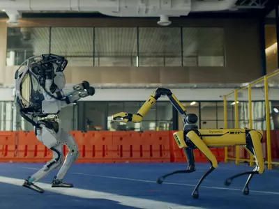

> _Se riuscirai a completare questa task con punteggio pieno (e gli altri problemi con punteggio medio strettamente maggiore di 20/25) riceverai, a scelta, il **badge GigaChad** o il **badge GigaStacy** che apparirà sul tuo profilo LuissTrain!_  
>
> - _Questa onorificenza verrà assegnata personalmente dal Prof. Italiano durante la lezione del 7 Aprile 2022._  


# Droni mutanti

Dopo aver partecipato a Crack The Puzzle, sei andato a visitare il campus Luiss di Viale Romania durante la giornata di orientamento per gli studenti delle scuole superiori di Sabato 23 aprile 2022.  
Proprio in quel momento, però, giunge al campus un esercito di droni umanoidi armati di bombolette di vernice spray. Questi ultimi sono chiaramente intenzionati a vandalizzare il Luiss LOFT dopo la sconfitta precedente: ora è compito tuo difenderlo!
Per fortuna nel LOFT è ancora custodito il 'raggio hackerante', una potente arma che ti sarà utile in questa sfida.  
I droni però si sono evoluti grazie ad una nuova intelligenza artificiale in grado di sviluppare codice in modo autonomo. Ora i droni mantengono una cronologia di tutte le modifiche apportate al loro sistema e, in caso di un attacco hacker, possono effettuare un rollback all'ultimo stato funzionante (un po' come la pagina Wikipedia del Prof. Italiano). L'unico modo per salvare il LOFT è spegnere definitivamente tutti i droni evitando così la loro riattivazione. Per far ciò, si può sfruttare un caso limite che l'AI non ha considerato: hackerando i droni seguendo una sequenza specifica, infatti, è possibile attivare la procedura di shutdown di un drone, impedendo quindi il rollback.
Il Prof. Laura ha scoperto l'algoritmo da seguire per spegnere definitivamente i droni e ti ha fornito le sequenze grazie alle quali è possibile attivare la procedura di shutdown per ognuno di essi.

  
*Uno dei droni, programmati con l'obiettivo di vandalizzare il Luiss LOFT*

Ciascun drone è numerato da $0$ a $N-1$. Ciascun drone può essere hackerato più volte, ma una volta che un drone è stato spento non può più essere hackerato.  
Per spegnere un drone $i$ è necessario che tutti i droni $j$ con indice inferiore $i \leq j$ siano stati spenti e che gli ultimi $k$ droni hackerati (includendo l'ultimo hackeraggio) rispettino una delle sequenze di disattivazione fornite dal Prof. Laura.
In altre parole, deve esistere una sequenza di disattivazione nella lista del Prof. Laura uguale agli ultimi $k$ droni hackerati rispettando lo stesso ordine. Altrimenti il drone hackerato si riattiva.

Poiché le batterie del raggio hackerante stanno per terminare, il tuo compito è trovare la sequenza di droni da hackerare che minimizza il numero di usi del raggio hackerante (ogni drone hackerato corrisponde a un utilizzo del raggio) e che disattiva tutti i droni.

## Assunzioni

- $2 \leq N \leq 10^3$
- $1 \leq M \leq 10^4$
- $2 \leq k \leq 10$
- $T \leq 100$.


## Casi di test
- Per il primo caso di test, il numero di sequenze di disattivazione sulla lista del Prof. Laura è inferiore a $2 \cdot 10^3$ ($M \leq 2 \cdot 10^3$) e la lunghezza di ogni sequenza di disattivazione è pari a 2 ($k = 2$).
- Per il secondo caso di test, il numero di sequenze di disattivazione sulla lista del Prof. Laura è inferiore a $2 \cdot 10^3$ ($M \leq 2 \cdot 10^3$) e la lunghezza di ogni sequenza di disattivazione è al più 3 ($ k \leq 3$).
- Per il terzo caso di test, la lunghezza di ogni sequenza di disattivazione è al più 3 ($ k \leq 3$).
- Per il quarto caso di test, non ci sono limitazioni rispetto a quanto riportato nella sezione "Assunzioni"

## Dati di input

La prima riga del file di input contiene un intero $T$, il numero di casi di test.  
Seguono $T$ casi di test, numerati da $1$ a $T$. Ogni caso di test è preceduto da una riga vuota.

Ogni caso di test inizia con una riga contenente tre interi $N$, $M$ e $k$.  
Seguono $M$ righe, ciascuna con $k$ valori $1 \leq v_i \leq N$, rappresentanti una sequenza di disattivazione valida.

## Dati di output

Il file di output deve contenere la risposta ai casi di test che sei riuscito a risolvere. Per ogni caso di test che hai risolto, il file di output deve contenere una riga con la dicitura

```
Case #t: 
```

dove `t` è il numero del caso di test (a partire da $1$).

Per ogni caso di test, deve essere presente un solo intero, il numero minimo di droni che dovrai hackerare per riuscire a disattivare tutti i droni. Se non esiste tale numero l'output deve essere -1.


## Esempi di input/output

---

**Input:**

```
2

3 4 2
0 0
1 1
2 0
2 2

3 4 3
2 1 2
0 2 1
0 0 0
0 0 2
```

---

**Output:**

```
Case #1: 6
Case #2: 6
```

---
