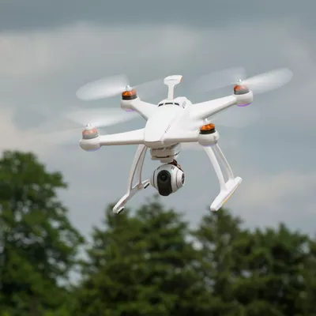

# Droni spia 
Dopo aver costruito il `raggio hackerante`, Carlo sale sul tetto del Luiss LOFT, dove la Prof.ssa Sinaimeri custodisce le soluzioni del Contest, e nota degli strani oggetti volanti in lontananza. Oh no, sono proprio dei Droni Spia inviati per rubare le soluzioni dei problemi del Contest! Per fortuna Carlo ha a disposizione il `raggio hackerante` appena costruito assieme a Michele.  
Ogni drone ha un tempo stimato di arrivo $t_i$: Al tempo $t_i$ il drone sorvolerà il Luiss LOFT e farà una foto alle preziose soluzioni ivi custodite. Carlo deve puntare il raggio hackerante contro ciascun drone e modificare il firmware del drone per disattivare la telecamera in modo da non far rubare le soluzioni del Contest custodite nel Luiss LOFT. Disattivare i droni richiede tempo, più precisamente Carlo spende $t = 2$ per ogni drone che riprogramma.  
Dopo qualche minuto, però, la Prof.ssa Sinaimeri fa notare a Carlo che la missione sarà più difficile del previsto, perchè gli $N = 2^i -1$ droni volano in formazione, in particolare:  
- la prima fila di droni è composta dai droni $i$ per $i \in { \frac{N-1}{2}, N - 1 }$.
- ciascun altro drone $i$ (eccetto i droni appartenenti alla prima fila) vola dietro al drone $2 \cdot i + 1$ e al drone $2 \cdot i + 2$.

Carlo scopre che non può disattivare il drone $i$ senza aver prima disattivato $2 \cdot i + 1$ e $2 \cdot i + 2$.  
Riuscirà Carlo a difendere il Luiss LOFT dai droni spia?  

  
*Uno dei droni spia in arrivo al LOFT*

## Assunzioni

- $N$, $t_i$ interi
- $N \leq 100000$ and $N = 2^i - 1$ per $i \geq 0$ intero.
- $t_i \leq 100000$ per $0 \leq i < N$ intero.
- $T \leq 100$.


## Casi di test
 - Per il primo gruppo di casi di test non ci sono più di $7$ droni ($N \leq 7$).
 - Per il secondo gruppo di casi di test non ci sono più di $5 \cdot 10^3$ droni e ciascun drone rispetta il criterio “chi vola dietro arriva dopo” (per ciascun $i \in {0, ..., \frac{n-3}{2} }$: il tempo di arrivo di ogni drone $i$ è maggiore di quello dei due che lo precedono).
 - Per il terzo gruppo di casi di test non ci sono più di $5 \cdot 10^3$ droni.
 - Per il quarto gruppo di casi di test, non ci sono limitazioni aggiuntive rispetto a quanto definito nella sezione `Assunzioni`.

## Dati di input

La prima riga del file di input contiene un intero $T$, il numero di casi di test.  
Seguono $T$ casi di test, numerati da $1$ a $T$. Ogni caso di test è preceduto da una riga vuota.  

Ciascun caso di test è composto da una riga contenente in numero $C$, il numero di sotto-casi di test per questo caso di test, seguito da $C$ righe, una per ogni sotto-caso di test.  
Per ogni sotto-caso di test l'input è composto da una riga: il primo numero $N$ il numero di droni, seguito da $N$ numeri interi indicanti il tempo di arrivo di ciascun drone.  


## Dati di output

Il file di output deve contenere la risposta ai casi di test che sei riuscito a risolvere. Per ogni caso di test che hai risolto, il file di output deve contenere una riga con la dicitura

```
Case #t: 
```

dove `t` è il numero del caso di test (a partire da $1$).

Per ogni caso di test deve essere presente una singola riga con $C$ stringhe separate da spazio, una per ogni sotto-caso di test. L'output di ogni sotto-caso di test deve essere `Droni_disattivati` se Carlo riesce a disattivare tutti i droni prima che anche un solo drone riesca ad arrivare al LOFT e fare una foto, altrimenti `Luiss_LOFT`.


## Esempi di input/output

---

**Input:**

```
2

2
7 7 6 5 1 2 8 9
3 3 1 1

1
3 20 2 5
```

---

**Output:**

```
Case #1: Luiss_LOFT Luiss_LOFT
Case #2: Droni_disattivati
```

---
