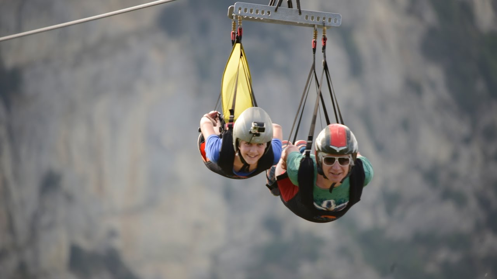

---

## Descrizione del problema

Dopo quasi due mesi trascorsi a preparare gli allenamenti per le selezioni territoriali delle Olimpiadi di Informatica e a risolvere problemi, il Team Olimpico della Luiss ha deciso di prendere qualche giorno di riposo. Si recheranno tutti insieme sulle Alpi a praticare il volo d'angelo, uno sport estremo che consiste nel discendere in carrucola dalle cime delle montagne fino a valle. La meta prescelta è la Valle D'Aosta, ricca di cime alte e quindi molto adrenaliniche!



Le $N$ cime principali della Valle D'Aosta sono state collegate da carrucole adatte ad effettuare il volo d'angelo, avendo cura di collegare una cima più alta ad una strettamente più bassa a patto che la distanza in linea d'aria tra le due cime sia minore o uguale alla lunghezza $D$ delle corde a disposizione. 
 
Per massimizzare il divertimento, i membri del team vogliono effettuare un volo d'angelo il più possibile lungo: hanno quindi pensato di partire dalla cima più alta e scendere di cima in cima, usando le varie carrucole, in modo da massimizzare la lunghezza totale della discesa fino a valle.

Il tuo compito è di aiutarli a trovare la lunghezza del volo più lungo. E fatto ciò, ricorda a tutti di allacciare bene le cinture!

## Dati di input

La prima riga del file di input contiene un intero $T$, il numero di casi di test. Seguono $T$ casi di test, numerati da $1$ a $T$. Ogni caso di test è preceduto da una riga vuota.

Ciascun caso di test è composto da $N+1$ righe. La prima riga contiene due interi separati da uno spazio: il primo intero rappresenta $N$, il numero di cime da cui parte almeno una carrucola, mentre il secondo intero rappresenta $D$, la lunghezza massima delle corde che possono collegare due cime. Ciascuna delle seguenti $N$ righe contiene tre interi $X_i$, $Y_i$ e $H_i$ separati da uno spazio: rispettivamente le coordinate $(X,Y)$ e l'altezza $H$ della $i$-esima cima. 

## Dati di output

Il file di output deve contenere la risposta ai casi di test che sei riuscito a risolvere. Per ogni caso di test che hai risolto, il file di output deve contenere una riga con la dicitura

```
Case #t: L
```

dove `t` è il numero del caso di test (a partire da $1$) e `L` rappresenta la lunghezza del volo d'angelo più lungo che parte dalla cima più alta, approssimata all'intero più vicino.  

## Assunzioni

- $1 \le T \le 20$.
- $1 \le N \le 1\,000$.
- $1 \le D \le 1\,000$.
- $1 \le X_i \le 1\,000$.
- $1 \le Y_i \le 1\,000$.
- $0 \le H_i \le 10\,000$.

Per calcolare la distanza in linea d'aria tra due cime, potete utilizzare le loro coordinate $(X,Y)$ e la formula per la distanza euclidea tra due punti in uno spazio bidimensionale. Due cime $a$ e $b$ sono connesse da una carrucola se la loro distanza in linea d'aria è minore o uguale a D e se l'altezza di $a$ è strettamente maggiore di quella di $b$.

## Esempi di input/output

---

**Input:**

```
1

7 3
6 6 700
8 7 800
3 3 300
7 5 1000
3 5 400
4 6 600
3 4 500
```

---

**Output:**

```
Case #1: 12
```

---

## Spiegazione

Immaginando che le cime siano:

- D in posizione $(6,6)$
- F in posizione $(8,7)$
- I in posizione $(3,3)$
- E in posizione $(7,5)$
- B in posizione $(3,5)$
- C in posizione $(4,6)$
- A in posizione $(3,4)$

poichè D=3, ci sono collegamenti tra le cime $(E,D)$, $(E,F)$, $(F,D)$, $(D,C)$, $(C,B)$, $(C,A)$, $(A,I)$, $(A,B)$ e $(B,I)$.


Il volo più lungo che parte da $E$, la cima di altezza massima, è quindi dato dal percorso $E$ $F$ $D$ $C$ $A$ $B$ $I$ che ha lunghezza $\sqrt{5}+\sqrt{5}+\sqrt{4}+\sqrt{5}+\sqrt{1}+\sqrt{4}+\sqrt{5}=3\sqrt{5}+2\sqrt{4}+\sqrt{1} = 11.708$, che approssimato all'intero più vicino dà 12.

