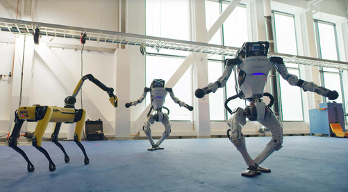

# **Robottini Mercenari** (*robottini*)

> **Attenzione**: Questo task ha un tempo limite di 10 minuti per l'invio della soluzione. Una volta richiesto un input, il timer partirà in automatico, e dopo la scadenza non sarà più possibile inviare una soluzione per quell'input.
> *È sempre possibile richiedere un nuovo input*, per cui non preoccuparti se il timer scade: dovrai semplicemente richiedere e scaricare un nuovo input.

La Professoressa Sinaimeri ha bisogno di assistenza durante le lezioni, in particolare nella moderazione della chat su Discord.
I tutor, resisi conto che i bot che hanno programmato sul server del nostro Corso sono inefficaci,
vogliono reclutare una squadra di robottini mercenari (facilmente reperibili nel dark web) per assisterli nel loro compito. Matteo e Maria Chiara, che hanno suggerito al resto dei tutor loro colleghi questa soluzione, scoprono di avere tra le mani dei robottini in carne e ossa – o meglio, in cavi e acciaio – ma decidono di impiegare comunque questi piccoli assistenti.

  
*Tre esemplari, probabilmente sottratti a una celebre società del Massachusetts*

---

Nello store dei robottini mercenari, viene specificato che ne esistono $N$ modelli, ciascuno classificato con un numero naturale $m$ e caratterizzato da una certa potenza $p$, numero naturale. 

In particolare, l'intero $m$ con cui è classificato ogni modello è compreso tra $2$ ed $M$ (estremi inclusi) e permette di risalire facilmente alle frequenze radio che lo stesso utilizerà. Infatti, il robottino mercenario classificato come $m$ avrà bisogno di utilizzare le frequenze corrispondenti a tutti i divisori di $m$ maggiori di $1$ (compreso $m$ stesso). Per essere telecomandato correttamente senza interferenze, queste frequenze dovranno essere lasciate libere, e quindi non dovranno essere utilizzate dagli altri robottini della squadra.

D'altro canto, la potenza $p$ caratteristica di ciascun modello rappresenta la sua «validità in battaglia», ed ha un valore compreso fra $0$ e $P$.

Nella selezione dei robottini da aggiungere alla sua squadra, i tutor devono fare in modo di poter telecomandare correttamente ogni robottino (facendo in modo che gli altri robottini della squadra non interferiscano sulle sue frequenze).

L'obiettivo è ovviamente creare la squadra di robottini più potente possibile, considerando che la potenza di una squadra corrisponde alla somma della potenza dei suoi membri.

Ad esempio, supponiamo che i modelli di robottino disponibili nello store abbiano le seguenti specifiche:

|Modello $m$|Potenza $p$|
|:---:|:---:| 
|4|2|
|6|3|
|9|4|
|12|5|
|15|6|

Allora, la squadra con massima potenza totale senza interferenze è composta dai robottini di modello $4$ e $15$, con una potenza totale di 8.

*Aiuta i tutor e la Professoressa Sinaimeri scrivendo un programma che restituisca la potenza massima possibile ottenibile evitando interferenze!*

---

## Dati di Input
Il tuo input, per ciascun caso di test, sarà dato da:
- $N$ che rappresenta il numero di modelli disponibili sul sito;
- $M$ che rappresenta il numero naturale massimo usato per classifocare un modello di robot
- una sequenza di $N$ modelli $m_i$ disponibili per la selezione
- una sequenza di $N$ potenze $p_i$ rispettivamente associate ai modelli disponibili elencati come $m_i$

---

## Assunzioni
- $0 \leq N \leq 50$ intero;
- $2 \leq M \leq 100$ intero;
- $0 \leq P \leq 100$ intero;
- $2 \leq m_i \leq M$;
- $0 \leq p_i \leq P$;

---

## Esempio esplicativo
**Input:**

```
2

5
50
4 6 9 12 15
2 3 4 5 6

6
70
12 27 30 67 70 41
53 17 65 90 60 10
```
Ovvero:
- il numero di casi di test ($T$), in questo caso 2;
- il numero di modelli disponibili nello store $N$ preceduto da una riga vuota (nel primo test 5);
- il numero naturale massimo usato per classificare un modello di robot $M$ (nel primo test 50);
- una prima sequenza di $N$ interi compresi tra $2$ e $M$ corrispondenti alle classi $m_i$ dei modelli di robot disponibili (nel primo test 4 6 9 12 15);
- una seconda sequenza di $N$ interi compresi tra $0$ e $P$ corrispondenti alle potenze $p_i$ rispettivamente associate ai modelli disponibili classificati nella prima sequenza (nel primo test 2 3 4 5 6);
- un nuovo $N$ preceduto da riga vuota relativo ad un secondo caso di test, e così via.

**Output:**

```
Case #1: 8
Case #2: 177
```

Nel primo caso di test, la potenza totale della squadra migliore è 8, infatti sono stati selezionati i robottini di classe 4 e 15.

Nel secondo caso di test, la potenza totale della squadra migliore è 177, infatti sono stati selezionati i robottini di classe 27, 67, 70 e 41.

---

*Aiuta la Professoressa Sinaimeri a creare la squadra di robot più forte per ogni configurazione dello store!*
